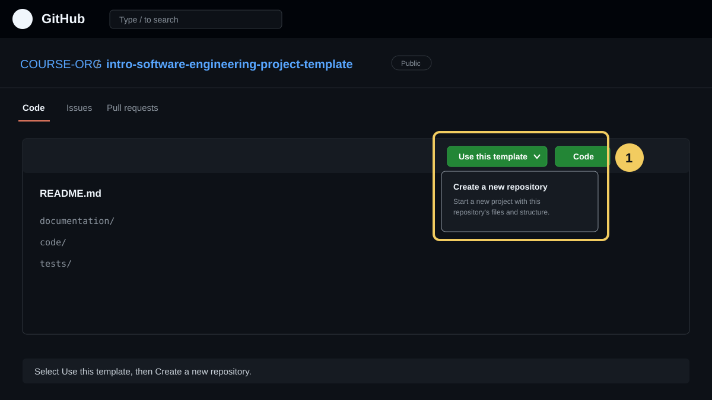
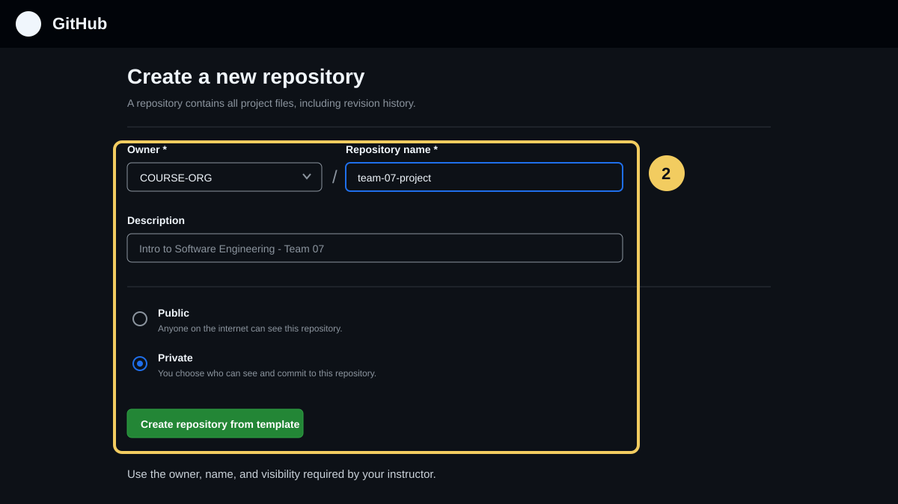
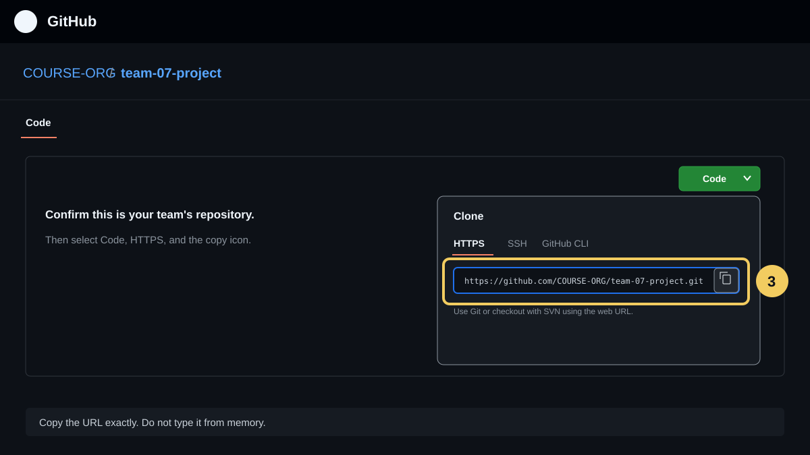
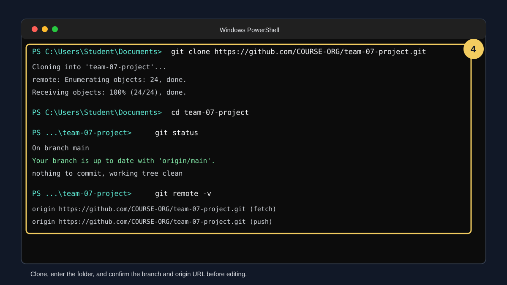

# Create and Clone Your Team Repository

Follow this guide before editing project files. The group leader completes Part 1 once. Every student, including the group leader, completes Parts 2 and 3 on their own computer. Part 4 is the branch workflow the whole team uses after setup.

The illustrations use the example names `COURSE-ORG` and `team-07-project`. Replace them with the owner and repository name shown on your team's GitHub page. GitHub may change small labels or button positions, but the workflow remains the same.

## Before You Begin

Each student needs:

- A GitHub account. The group leader also needs the course template URL and permission to use it.
- Git installed from [git-scm.com/install](https://git-scm.com/install/).
- A terminal: PowerShell or Git Bash on Windows, or Terminal on macOS/Linux.
- A code editor such as [Visual Studio Code](https://code.visualstudio.com/).
- A reliable folder for school projects, such as `Documents`.

Check that Git is installed:

```console
git --version
```

Expected output resembles `git version 2.51.0`. If the command is not recognized, install Git, close the terminal, open a new terminal, and try again.

## Part 1: Group Leader Creates the Team Repository

Do this once per group. The result must be the team's shared, team-owned project repository. Do not add student work directly to the instructor's template repository.

### 1. Open the Course Template

1. Sign in to GitHub.
2. Open the template repository URL provided by the instructor.
3. Select **Use this template** near the upper-right corner.
4. Select **Create a new repository**.



### 2. Create the Team's Copy

1. Under **Owner**, select the course or team organization. Use the group leader's account only if the instructor directs you to do so; GitHub requires an organization or account to be the formal owner.
2. Enter the required repository name. A clear example is `team-07-project`.
3. Add a short description containing the course and team number.
4. Choose **Public** or **Private** according to course policy. Do not make coursework public unless the instructor permits it.
5. Leave **Include all branches** off unless the instructor says otherwise.
6. Select **Create repository from template**.



This new shared repository is the team-owned repository used throughout this guide. It should contain this README plus the `documentation/`, `code/`, and `tests/` folders.

### 3. Give All Team Members Access

If a course organization or GitHub Classroom did not add the group automatically, the group leader must add the other students:

1. Open the new team repository, not the original template.
2. Select **Settings**.
3. Select **Collaborators and teams** or **Collaborators** under **Access**.
4. Select **Add people**.
5. Invite the other three students by GitHub username.
6. Each invited student must accept the email or GitHub invitation before pushing. For a private repository, accept it before cloning.

For an organization repository, use the **Write** role unless the instructor requires another role. Students need to push branches, not administer repository settings. Do not share passwords or access tokens.

## Part 2: Each Member Copies the Clone URL

Every student, including the group leader, must clone the team-owned repository to their own computer.

1. Open the team's repository on GitHub.
2. Confirm the owner and repository name at the top. Do not continue if this is still the instructor's template.
3. On the repository's **Code** tab, select the green **Code** button.
4. In the **Code** menu, select **HTTPS**.
5. Select the copy icon beside the URL. It should resemble:

```text
https://github.com/COURSE-ORG/team-07-project.git
```



HTTPS is recommended for beginners. Students who already configured an SSH key may select **SSH** and use the SSH URL instead.

## Part 3: Clone the Repository

### 1. Open a Terminal in the Parent Folder

Choose where the repository folder should be created. Run `git clone` from the parent folder; do not manually create the repository folder first.

Windows PowerShell example:

```powershell
Set-Location -Path "$HOME\Documents"
```

macOS or Linux example:

```bash
cd ~/Documents
```

These examples assume that `Documents` exists. If it does not, use an existing parent folder; use `Set-Location -Path $HOME` in PowerShell or `cd ~` on macOS/Linux to use your home folder.

Confirm the location before cloning.

Windows PowerShell:

```powershell
Get-Location
```

macOS or Linux:

```bash
pwd
```

### 2. Run `git clone`

Paste the URL copied from the team's repository:

```console
git clone https://github.com/COURSE-ORG/team-07-project.git
```

Replace the example URL with the actual URL. Expected output includes messages such as `Cloning into`, `Receiving objects`, and `done`.



For a private repository, GitHub may open a browser sign-in window. Complete that sign-in. GitHub account passwords cannot be entered directly as Git passwords.

### 3. Enter and Verify the Repository

Use the actual repository folder name:

```console
cd team-07-project
git status
git remote -v
```

A successful setup should show:

- The default branch, normally `main`.
- A clean working tree before you edit anything.
- An `origin` remote whose fetch and push URLs point to the team's repository.

Confirm that these paths exist:

```text
README.md
documentation/
code/
tests/
```

### 4. Check Your Commit Name and Email

Before your first commit, check the identity Git will use:

```console
git config --get user.name
git config --get user.email
```

No output means that a value is not set. If either value is missing or wrong, choose one scope. On a personal computer, set the identity for all repositories:

```console
git config --global user.name "Your Full Name"
git config --global user.email "your-github-email@example.com"
```

On a shared or lab computer, set it only for this repository by omitting `--global`:

```console
git config user.name "Your Full Name"
git config user.email "your-github-email@example.com"
```

Use an email connected to your GitHub account if you want commits attributed to your profile. GitHub also provides a private `noreply` email in **Settings > Emails**.

### 5. Open the Repository in Your Editor

Open the repository in Visual Studio Code if the `code` command is installed:

```console
code .
```

Otherwise, open the editor and use **File > Open Folder** to select the cloned repository folder.

## Part 4: Use a Branch for Each Change

Do not commit or push project work directly to `main`. Create a short-lived branch for each task.

Before creating a branch, run `git status`. Continue only when the working tree is clean. If it lists changes, do not pull or discard them; move them to the correct task branch or ask a teammate for help. Then update `main` and create the task branch:

```console
git switch main
git pull --ff-only
git switch -c docs/project-proposal
```

If `git status` showed a different default branch name after cloning, use that name instead of `main` throughout this guide.

After editing and reviewing the intended files:

```console
git status
git diff
git add README.md documentation/01-project-proposal.md
git diff --staged
git commit -m "Add project proposal and team details"
git push -u origin docs/project-proposal
```

Use the link printed by `git push`, or open the repository on GitHub. Create a pull request, ask a teammate to review it, and merge it according to the workflow recorded in the [team collaboration log](06-team-collaboration-log.md).

Before beginning later work, return to `main` and download the team's latest changes:

```console
git status
git switch main
git pull --ff-only
```

Run the switch and pull only when `git status` shows a clean working tree. Do not run `git clone` again for daily updates; update the existing clone.

## SSH Alternative

Use SSH only if your public SSH key is already added to GitHub.

1. Test the configured key with `ssh -T git@github.com`. On the first connection, compare the displayed fingerprint with [GitHub's published SSH key fingerprints](https://docs.github.com/en/authentication/keeping-your-account-and-data-secure/githubs-ssh-key-fingerprints) before accepting it. A successful test says that you authenticated and that GitHub does not provide shell access.
2. In the GitHub **Code** menu, select **SSH**.
3. Copy the URL resembling `git@github.com:COURSE-ORG/team-07-project.git`.
4. Run:

```console
git clone git@github.com:COURSE-ORG/team-07-project.git
```

If GitHub reports `Permission denied (publickey)`, use HTTPS or follow GitHub's [SSH key setup guide](https://docs.github.com/en/authentication/connecting-to-github-with-ssh).

## Troubleshooting

### `git` Is Not Recognized

Install Git, then close and reopen the terminal. On Windows, confirm that the Git installer added Git to `PATH`.

### `Repository not found`

- Confirm that the copied URL belongs to the team's repository.
- Sign in with the GitHub account that was invited.
- Accept the collaborator invitation.
- Complete organization sign-on authorization if the course organization requires it.
- Ask the group leader to verify the exact GitHub username and repository access.

### `Destination path ... already exists and is not an empty directory`

You are cloning into a location that already contains a folder with the repository name. If that folder is already the correct clone, enter it and run `git status`. Otherwise, choose a different parent folder or rename the unrelated existing folder. Do not delete work you have not backed up.

### Authentication Fails Over HTTPS

Complete the browser login opened by Git Credential Manager or another credential helper. If the terminal asks for a password instead, enter a GitHub personal access token only at that prompt; GitHub account passwords do not work for Git operations. Never paste a token into project files, chat, screenshots, or commits.

### `origin` Points to the Template Repository

Stop before pushing. Return to GitHub, open the team-owned repository, and copy its URL. If no work needs to be preserved, clone the correct repository in a separate folder. Ask the instructor before changing remotes if you are unsure.

### Changes from Teammates Are Missing

Confirm that you are inside the correct repository and run `git status`. If it lists uncommitted work, preserve that work before switching branches. When the working tree is clean, run:

```console
git switch main
git pull --ff-only
```

If Git reports local conflicts, do not discard files. Coordinate with the teammate who changed the same lines and follow the team's conflict-resolution process.

### `git pull --ff-only` Cannot Fast-Forward

Stop and ask a teammate or instructor for help. A local branch and the GitHub branch have diverged. Do not force-push, reset, or delete files to make the message disappear.

## Setup Checklist for Every Student

- [ ] I can access the team-owned repository and accepted an invitation if I received one.
- [ ] I cloned the team repository, not the instructor's template.
- [ ] `git status` works inside my local repository.
- [ ] `git remote -v` points to the correct team repository.
- [ ] I can see `documentation/`, `code/`, and `tests/`.
- [ ] My Git name and email are correct.
- [ ] I know how to create a branch, commit, push, and open a pull request.
- [ ] I have not committed passwords, tokens, or other secrets.
